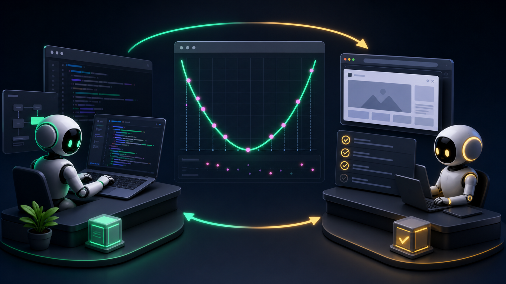

# Quadratic Fitter: AI-Collaborative ML Demo



Quadratic Fitter is an interactive React application for exploring how a neural network can learn a quadratic relationship from user-provided points. Users click points on a coordinate plane, configure the neural network, train the model in the browser, and compare the learned curve with an extracted quadratic equation:

```text
y = ax² + bx + c
```

The project was developed as an AI-assisted collaboration. Google Antigravity handled the implementation work, while Codex focused on browser-based functional testing, regression testing, and reporting issues back into the development loop.

## Features

- Interactive canvas for adding training points.
- Neural network controls for hidden layers, neurons per layer, activation function, learning rate, and epochs.
- In-browser training with TensorFlow.js.
- Live training status, epoch count, loss, and progress.
- Fitted quadratic coefficient display for `a`, `b`, and `c`.
- Visual comparison between the neural network prediction curve and the fitted quadratic curve.
- Reset, undo, clear, and retrain flows for iterative experimentation.
- Responsive layout for desktop and mobile screens.

## AI Collaboration Process

This project was built through a practical AI-to-AI development workflow:

1. **Google Antigravity developed the application**

   Google Antigravity implemented the React/Vite application, TensorFlow.js model flow, canvas visualization, training controls, and responsive UI behavior.

2. **Codex tested the application in the browser**

   Codex ran the app locally, opened it in a browser, and tested the complete functional surface: point creation, training, stopping, resetting, responsive layout, parameter changes, and fitted curve accuracy.

3. **Codex reported issues with reproducible steps**

   When problems appeared, Codex documented them as focused test reports with actual behavior, expected behavior, error messages, and likely implementation causes.

4. **Google Antigravity fixed the issues**

   The development agent used the reports to patch the application, after which Codex reran the same browser tests to verify the fixes.

5. **The cycle repeated until the app passed regression testing**

   This feedback loop helped catch both obvious UI problems and deeper behavioral issues, including parameter type handling, disposed TensorFlow models, mobile canvas sizing, and resize behavior.

## Issues Found and Fixed During Development

The AI collaboration process uncovered and resolved several real defects:

- Mobile layout originally had horizontal overflow.
- Mobile canvas sizing regressed to an unusably small size after the first layout fix.
- Some form controls initially lacked accessible labels.
- The reset button label did not match its actual behavior.
- Changing `hiddenLayers`, `neuronsPerLayer`, or `activation` after training did not correctly retrain the model.
- `neuronsPerLayer` could be passed to TensorFlow.js as a string, causing a model construction error.
- A failed retrain could leave a disposed model referenced, causing repeated `Container is already disposed` errors.
- Resize behavior triggered `ResizeObserver` warnings during viewport changes.

## Final Regression Result

Codex verified the final version with browser-based regression tests:

- Mobile layout has no horizontal overflow.
- Mobile canvas remains usable at `280 × 280`.
- Hidden layer changes retrain successfully.
- Neuron count changes retrain successfully.
- Activation function changes retrain successfully.
- The `Trained:` status updates to the current configuration after each retrain.
- Browser console shows no application errors.
- Network requests complete successfully.
- Randomly generated quadratic training data produces fitted coefficients close to the expected equation.

Example tested function:

```text
y = 0.07x² - 0.25x + 0.8
```

One final trained result was approximately:

```text
y = 0.0688x² - 0.2471x + 0.8324
```

This is close enough for the intended interactive machine learning demonstration.

## Tech Stack

- React
- Vite
- TensorFlow.js
- Lucide React
- HTML Canvas

## Getting Started

Install dependencies:

```bash
npm install
```

Start the development server:

```bash
npm run dev
```

Open the local URL shown by Vite, usually:

```text
http://localhost:5173/
```

Build for production:

```bash
npm run build
```

Preview the production build:

```bash
npm run preview
```

## How to Use

1. Click at least three points on the canvas.
2. Adjust the network parameters.
3. Start training.
4. Watch the prediction curve fit the points.
5. Compare the extracted quadratic equation with the point pattern.
6. Change parameters and retrain to compare different model behaviors.

## Image Asset

The README banner was generated with GPT-image 2 for this project. It illustrates the development workflow: Google Antigravity building the app, Codex testing it, and the quadratic model sitting between implementation and verification.

## Development Note

This repository is an example of collaborative AI software engineering. The important part is not just that AI generated code or tests, but that two AI agents played different engineering roles: one as the developer and one as the tester. That separation made the workflow more rigorous and helped drive the app toward a working, verified result.
